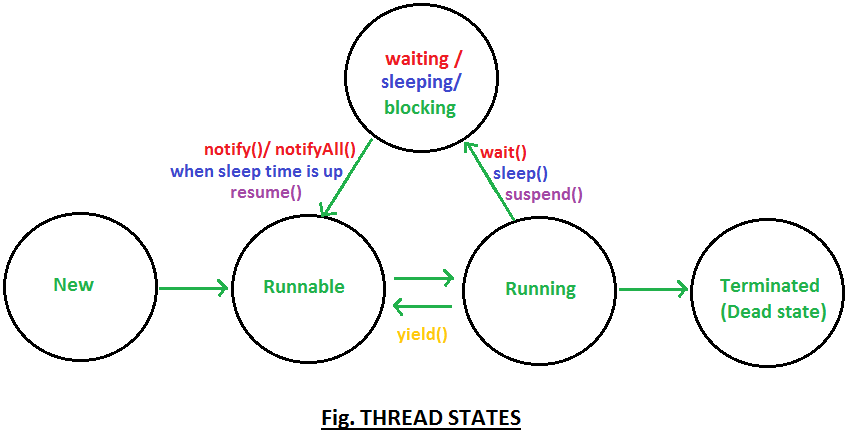

# Multi-threading
A thread is a light-weight smallest part of a process that can run concurrently
with the other parts(other threads) of the same process.
Threads are independent because they all have separate path of execution 
that’s the reason if an exception occurs in one thread,
it doesn’t affect the execution of other threads. All threads of a process share the common memory.

<b>The process of executing multiple threads simultaneously is known as multithreading.</b>

Let’s summarize the discussion in points:
1. The main purpose of multithreading is to provide simultaneous execution of two or more parts of a program to maximum utilize the CPU time. A multithreaded program contains two or more parts that can run concurrently. Each such part of a program called thread.

2. Threads are lightweight sub-processes, they share the common memory space. In Multithreaded environment, programs that are benefited from multithreading, utilize the maximum CPU time so that the idle time can be kept to minimum.

3. A thread can be in one of the following states:
NEW – A thread that has not yet started is in this state.
RUNNABLE – A thread executing in the Java virtual machine is in this state.
BLOCKED – A thread that is blocked waiting for a monitor lock is in this state.
WAITING – A thread that is waiting indefinitely for another thread to perform a particular action is in this state.
TIMED_WAITING – A thread that is waiting for another thread to perform an action for up to a specified waiting time is in this state.
TERMINATED – A thread that has exited is in this state.
A thread can be in only one state at a given point in time.

### Start function will execute the run function.
